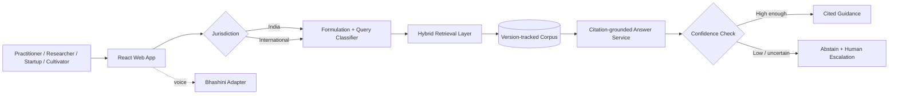

# IP-SAKTI Sahayak

> **SIH26045 · Smart India Hackathon 2026 · Team JanSetu**

A multilingual, source-cited AI assistant for **Intellectual Property and regulatory guidance in Ayurveda**, with clearly separated **India** and **International** regimes.

> **Important:** This project provides information, not legal advice. It is designed to cite authoritative sources, show confidence, abstain when uncertain, and route complex cases to a human IP facilitator.

## Problem

Ayurveda innovators must navigate overlapping IP, biodiversity, product-regulation, market-access, and traditional-knowledge concerns. The official SIH problem statement calls for one deployable assistant that can classify a formulation, route the question to the right IP/regulatory area, retrieve authoritative material, and return traceable guidance without mixing jurisdictions.

## MVP capabilities

- Multilingual-ready React interface
- Explicit **India / International** jurisdiction switch
- Ayurvedic formulation classification flow
- Query routing across patents, GI, trademarks, designs, copyright, plant-variety rights, trade secrets, ABS, and market access
- Curated source registry with version metadata
- Citation-first retrieval service
- Confidence scoring and safe abstention
- Human-facilitator escalation flag
- TKDL / prior-art and ABS guidance entry points
- Bhashini-ready speech adapter boundary
- PostgreSQL + pgvector schema for a future production corpus
- Audit and consent data model for controlled source access

## Architecture



Detailed design: [`docs/ARCHITECTURE.md`](docs/ARCHITECTURE.md)

## Repository structure

```text
ip-sakti-sahayak/
├── backend/                  # FastAPI API + retrieval/classification services
├── frontend/                 # React + Vite UI
├── docs/                     # Architecture, roadmap, sources, evaluation
├── .github/workflows/        # CI
├── docker-compose.yml
├── .env.example
└── README.md
```

## Quick start

### 1. Backend

```bash
cd backend
python -m venv .venv
# Windows: .venv\\Scripts\\activate
# macOS/Linux: source .venv/bin/activate
pip install -r requirements.txt
uvicorn app.main:app --reload --port 8000
```

API docs: `http://localhost:8000/docs`

### 2. Frontend

```bash
cd frontend
npm install
npm run dev
```

Frontend: `http://localhost:5173`

### 3. Optional database

```bash
docker compose up db
```

The current demo retrieval layer runs from a curated JSON registry so the MVP can start without database setup. The PostgreSQL/pgvector schema is included for the next implementation step.

## API overview

| Method | Endpoint | Purpose |
|---|---|---|
| `GET` | `/api/health` | Service health |
| `GET` | `/api/meta` | Product capabilities and disclaimer |
| `GET` | `/api/sources` | Curated source registry |
| `POST` | `/api/classify` | Formulation classification |
| `POST` | `/api/chat` | Jurisdiction-aware cited guidance |

## Source policy

The project is intentionally designed around **authoritative, version-tracked material**. The initial source leads in this repository are taken from the SIH26045 problem statement and include TKDL, India Code, IP India, the National Biodiversity Authority, relevant Indian product-regulation sources, and international treaty systems.

Production ingestion must preserve source metadata, never fabricate citations, keep India and International materials separate, refuse unsupported answers, and use paid/private sources only with explicit logged permission.

See [`docs/DATA_SOURCES.md`](docs/DATA_SOURCES.md).

## SIH delivery roadmap

**Phase 1 — citation-grounded MVP:** curated corpus, formulation classification, jurisdiction-aware retrieval, mandatory citations, confidence + abstention.

**Phase 2 — deeper reasoning:** relational knowledge graph, multi-source orchestration, stronger retrieval and citation evaluation.

**Phase 3 — expanded access:** paid-source connectors with logged consent, broader Indian-language support, Bhashini text/voice integration, and broader international market-access coverage.

See [`docs/ROADMAP.md`](docs/ROADMAP.md).

## Team

**Team JanSetu**  
SIH Team ID: **190535**  
Problem Statement: **SIH26045**  
Category: **Software**  
Theme: **MedTech / BioTech / HealthTech**
